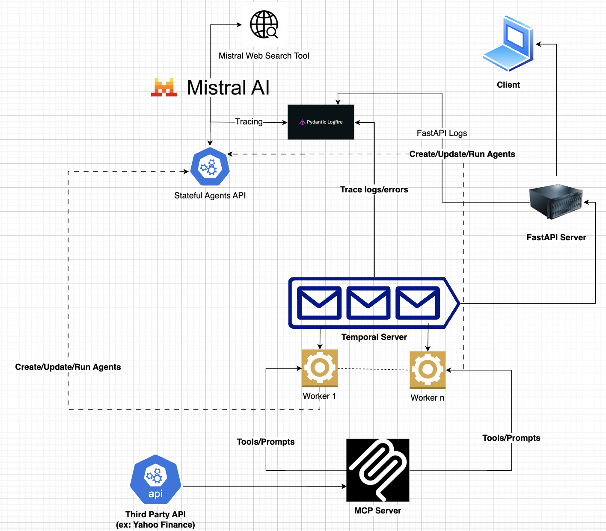
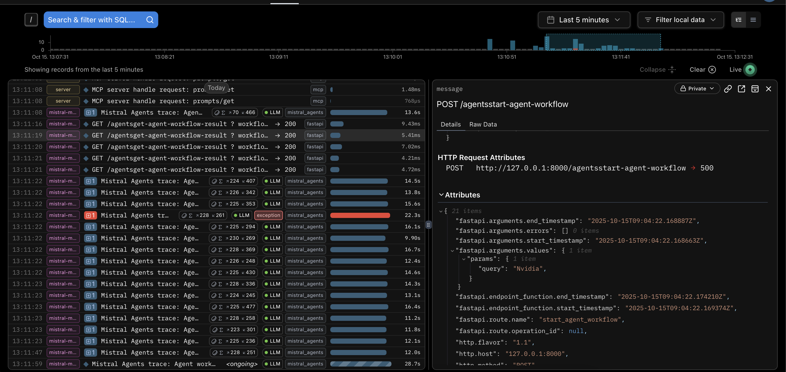
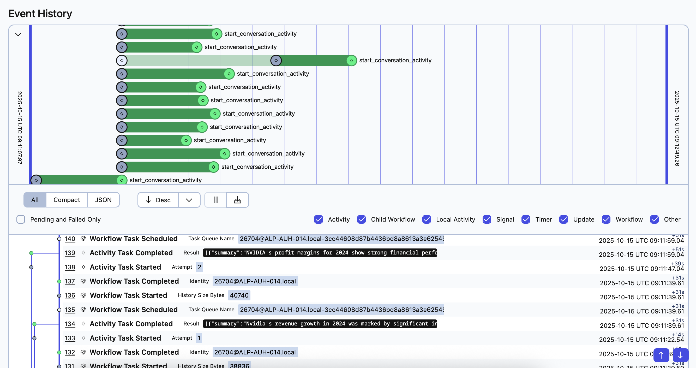

# Durable Stateful Agents with Mistral + Temporal + MCP

**Production-grade agent orchestration for long-running tasks that don't fail.**

LLM agents break on multi-step workflows. API timeouts kill progress. Conversation state gets lost. Manual retry logic is brittle. This architecture solves it:

- **Mistral Agent API** manages conversation state server-side (no history passing)
- **Temporal** orchestrates durable execution with automatic retries
- **MCP** provides standardized tool interfaces (swap providers without code changes)
- **Logfire** instruments the entire request path for production observability

Built for critical workflows where tasks can take minutes and failures are expensive.

<p align="left">
  
</p>

## Evolution from Previous Work

This extends my [durable agents with Temporal](https://temporal.io/code-exchange/mcp-temporal-durable-agents) project with:
- **Stateful agents** – Mistral manages agent definitions and conversation history server-side (beta feature)
- **Enhanced retries** – [HTTP retry mechanism](https://docs.temporal.io/ai-cookbook/http-retry-enhancement-python) distinguishes retriable vs. terminal failures
- **API gateway** – FastAPI server triggers workflows and polls results for frontend clients
- **Full observability** – Logfire traces capture MCP/FastAPI servers transactions, agent status, token usage, and retry behavior
- **MCP tools** – Dedicated MCP server with Yahoo Finance integration

## Architecture

**Core Stack:**
- **Mistral AI Agent API** – Server-side stateful agents. Register agents on Mistral's infrastructure, update their configurations, and run multi-turn conversations with persistent state managed by Mistral.
- **Temporal Workflows** – Durable orchestration. Activities automatically retry on failure; workflows resume from last checkpoint.
- **MCP Server** – Exposes tools and prompts over HTTP/SSE. Agents discover capabilities at runtime.
- **Logfire** *(optional)* – OpenTelemetry-native observability. Auto-instruments FastAPI endpoints and Mistral agent calls with full request/response traces.

**Key Design Decisions:**
1. **Mistral hosts agent state server-side** – Unlike traditional stateless LLM APIs, Mistral's Agent API maintains agent definitions and conversation history on their servers. You register agents once, then interact via `agent_id`.
2. **Temporal workflows orchestrate agent interactions** – Workflow state persists locally while Mistral manages agent and conversation state remotely. Workflows survive crashes and coordinate multi-step agent tasks.
3. **Prompt and tools access via MCP server** – Temporal activities create agents with instructions fetched from a local MCP server. Instruction prompts are separated from code. Agents can run available tools server side.
4. **FastAPI orchestrates requests** – Receives user queries, triggers Temporal workflows, and polls workflow results using Temporal query handles.
5. **Logfire instruments the entire request path** – Captures FastAPI route traces, Mistral API calls with token usage, and correlates them in a unified trace view.

**Data Flow:**
```
User Request → FastAPI → Temporal Workflow → Mistral Agent API (stateful)
      ↓            ↓              ↓                  ↓
   Logfire ←──────┴──────────────┴──────────────────┘
                                         ↓
                                 MCP Server (tools/prompts)
                                         ↓
                                 Execute tool activities
                                         ↓
                                 Stream response → User
```

## Quick Start

### Prerequisites
- Python 3.11+ with `uv`
- Temporal CLI (`brew install temporal`)
- Mistral API key

### 1. Environment Setup
```bash
uv sync
source .venv/bin/activate
```

### 2. Launch Services (in separate terminals)

**Terminal 1: MCP Server**
```bash
export PYTHONPATH=.
uv run uvicorn mcp_server.main:app --reload --port 9000
```

To inspect and interact with the server, run:
```
export PYTHONPATH=.
mcp dev mcp_server/financial_research_server.py
```

**Terminal 2: Temporal Dev Server**
```bash
temporal server start-dev
```

**Terminal 3: Temporal Worker**
Executes workflow and activity tasks.
```bash
export PYTHONPATH=.
uv run --env-file .env tasks/worker.py
```

**Terminal 4: FastAPI Gateway**
```bash
export PYTHONPATH=.
uv run uvicorn api.main:app --reload
```

### 3. Test the Agent
```bash
export PYTHONPATH=.
uv run --env-file .env examples/main.py
```

**API Documentation:** http://localhost:8000/docs

## Observability in Action

<p align="left">
  
</p>

The screenshot above shows a financial query about Nvidia triggered via FastAPI. **Logfire** captures the entire execution path:
- MCP prompt fetching
- FastAPI request lifecycle
- Mistral agent execution status and metadata (including token usage)
- **Automatic retry behavior**: One Mistral API call failed due to a structured output parsing error. Temporal automatically retried until it succeeded.

<p align="left">
  
</p>

The Temporal UI shows the workflow's event history, including the `start_conversation_activity` that failed once (Attempt 2) before succeeding. 
This demonstrates how Temporal's durable execution handles transient failures without developer intervention.

## Why This Stack?

**Mistral's stateful agents** are unique among LLM providers—agents are registered and managed server-side, eliminating the need to pass full conversation history with every request.

**Temporal** handles transient failures (API timeouts, rate limits) with automatic retries and orchestrates complex multi-agent workflows. Workflow state persists across process restarts.

**MCP** decouples tool implementation from agent logic. Swap tool providers without changing agent code. Standardized interface for tool discovery and execution, and prompts.

**Logfire** provides a unified view of workflow executions, LLM calls (with prompts, completions, token counts), and FastAPI request lifecycle—critical for debugging production issues.